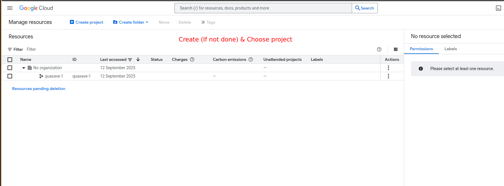
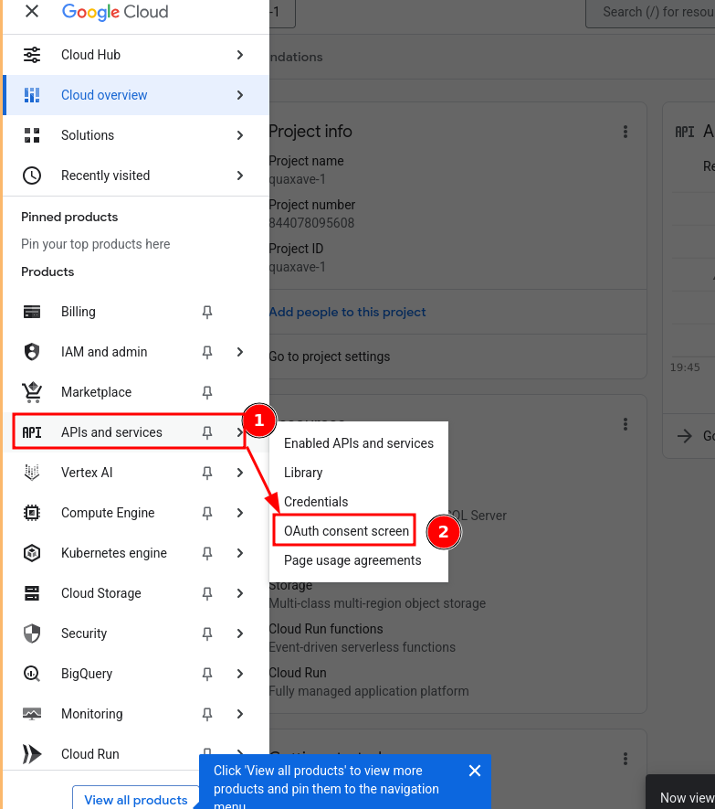
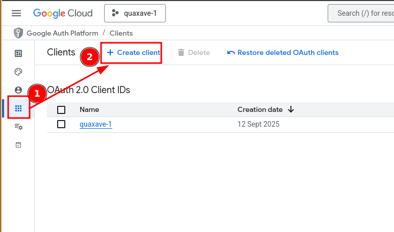
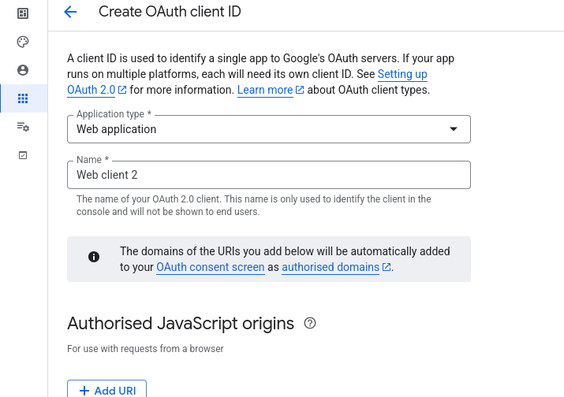
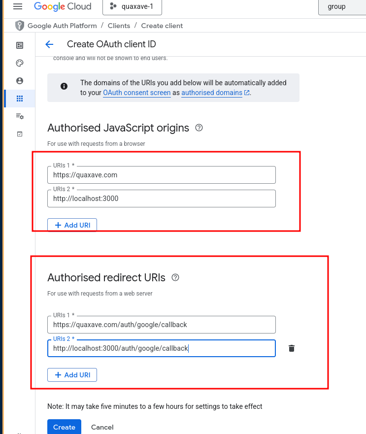
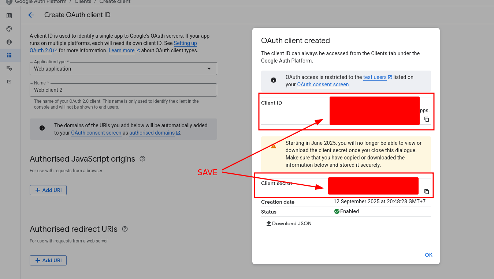
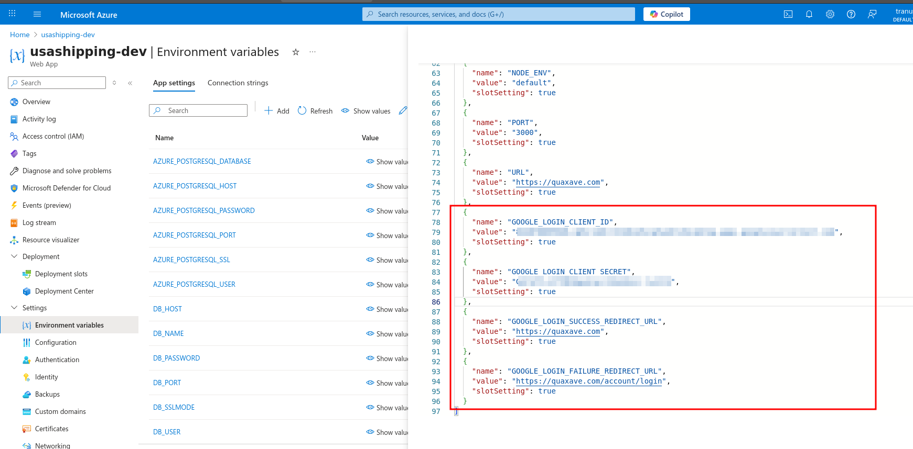

# Google SSO

[Evershop's Google SSO extension](https://github.com/evershopcommerce/evershop/tree/dev/extensions/google_login)
[The extension NPM registry](https://www.npmjs.com/package/@evershop/google_login?activeTab=versions)

## Google Cloud Platform (GCP) setup
Create OAuth client & save secret








## Setup Application

### Install extension
We use `v1.2.1` for now since the latest one might require us to update @evershop to latest.
`npm install @evershop/google_login`

### Enable extension

```json
{
  ...,
  "system": {
    ...,
    "extensions": [
      ...,
      {
        "name": "google_login",
        "resolve": "node_modules/@evershop/google_login",
        "enabled": true,
        "priority": 10
      }
    ]
  }
}
```

### Update ENV

#### Local
Update `.env` file

```toml
GOOGLE_LOGIN_CLIENT_ID="YOUR_GOOGLE_CLIENT_ID"
GOOGLE_LOGIN_CLIENT_SECRET="YOUR_GOOGLE CLIENT_SECRET"
GOOGLE_LOGIN_SUCCESS_REDIRECT_URL="https://example.com"
GOOGLE_LOGIN_FAILURE_REDIRECT_URL="https://example.com/account/login"
```

#### Azure App service
Update ENV


